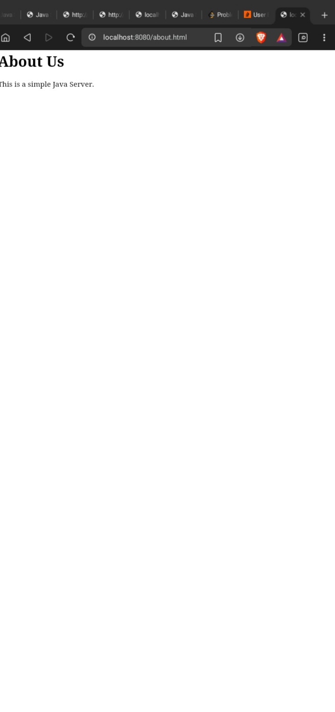
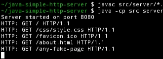

Educational Project — Built to understand low-level web server architecture.

# ⚡ JavaCore HTTP Engine

### 1️⃣ Project Overview
A simple web server built from scratch using Java Sockets. It handles requests, serves files, and logs activity in real-time.

### 📸 Evidence of Work

### 2️⃣ Features
- **Multi-threaded**: Handles many visitors at once.
- **Styling**: Serves CSS for a professional UI.
- **Error Handling**: Custom 404 page support.

### 3️⃣ How It Works
- **HttpServer**: Listens for connections on port 8080.
- **ClientHandler**: Processes requests on separate threads.
- **ResponseBuilder**: Formats correct HTTP/1.1 headers.

### 4️⃣ How To Run
1. **Compile**: `javac src/server/*.java`
2. **Start**: `java -cp src server.HttpServer`
3. **Open Browser**: Type `localhost:8080` manually.

### 🖥️ Terminal Output
When you visit the site, Termux will log:
`HTTP: GET / HTTP/1.1`
